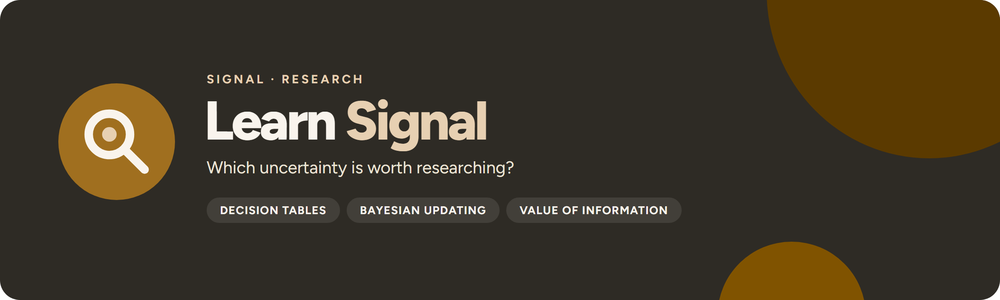

<p align="center">
  
</p>

<p align="center">
  <a href="https://github.com/UlrikErlingsen/research-prioritization/actions"></a>
  <a href="https://github.com/UlrikErlingsen/signal-hub"></a>
  
  
  <a href="LICENSE"></a>
</p>

<p align="center"><strong>Find out which study could change your decision, and whether it is worth what it costs.</strong></p>

**Learn Signal** helps marketers, product owners and analysts decide what to research before they commit to a choice. It combines a decision table (options, future scenarios and net payoffs) with Bayesian updating of each proposed study's possible results, so the expected value of perfect information and of each realistic study can be compared with its cost.

> Which uncertainty is worth paying to research before you decide?

Everything runs locally with open-source Python packages. There is no account, telemetry, external AI call, remote database, or built-in persistence.

## Read this first

> **Every number Learn Signal shows is conditional on what you enter.** The value of information depends entirely on the scenario probabilities (priors), the payoffs and the accuracy you assume for each study. Change them and the ranking of studies can change too.

- **The app estimates nothing from data.** Priors, payoffs, study costs and the probability of each study result in each scenario are your assumptions or estimates. Learn Signal checks that they are coherent (probabilities sum to 1, every cell is filled) and does the exact arithmetic. It does not judge whether they are right.
- **EVPI is a ceiling, not a budget.** The expected value of perfect information is the most any study could be worth under your model. A real study resolves only part of the uncertainty, so its expected value of sample information (EVSI) is lower.
- **A positive value after study cost does not authorise spending.** It says the study is expected to pay for itself under these inputs, assuming a risk-neutral decision maker who acts on the result. Studies are valued one at a time; their values cannot be added.
- **Nothing is calculated until a person has reviewed the inputs.** Imported or edited drafts stay unreviewed, and results are withheld, until you record who checked them and what was checked. The optional AI workflow only helps structure a draft; unknown numbers stay blank rather than being guessed.

## Scope

**Version 1.0 supports:**

- a finite decision model with 2–30 mutually exclusive scenarios, 2–12 decision options and a net payoff for every option in every scenario, in one stated unit and time horizon;
- up to 12 candidate studies, each with a cost and up to 10 possible results, described by the probability of each result in each scenario, P(result | scenario);
- up to 20 questions, each describing what a perfectly answered uncertainty would reveal about the scenarios;
- exact expected values, expected opportunity loss, EVPI, EVSI and net value after study cost, the preferred decision after each study result, posterior scenario probabilities and the value of perfectly answering each question;
- a one-way sensitivity check on any scenario's prior;
- three ways in: an Excel or CSV upload with explicit column matching, manual entry, or a copy-and-paste AI prompt that returns JSON;
- a local review record, and exports as an Excel workbook, project JSON, printable HTML brief and evidence ZIP.

**It does not:** estimate priors, payoffs or study accuracy from data; handle continuous distributions or simulation-based value of information; plan sequential studies, combinations of studies or sample sizes; model risk aversion other than by entering utilities as payoffs; discount over time; or analyse a study once it has been run. Whether a concept deserves investment at all is **[Gate Signal](https://github.com/UlrikErlingsen/launch-decision-gate)**'s question, and the results of a randomised test belong in **[Experiment Signal](https://github.com/UlrikErlingsen/experiment-analysis)**.

## Try the demo in three minutes

1. Start the app. **Overview** opens on a fictional, already reviewed example: a restaurant can launch a lunch service, run a small pilot or hold, and demand may be higher (prior 0.4) or lower (0.6).
2. Open **3 · Decision & research value**. Full launch is preferred with an expected 20,000 NOK; perfect information would raise that to 56,000, so EVPI is 36,000. The structured demand test (80% accurate, cost 8,000) is worth 17,600, or 9,600 after its cost. The cheaper exploratory survey (55% accurate, cost 3,000) can change the decision but is worth only 300, so it loses 2,700.
3. Open **4 · Results & sensitivity**. After a positive structured test you would launch; after a negative one you would hold. Pick **Higher demand** under **State to vary** to see where the preferred decision switches as its prior moves from 0 to 1.
4. Open **5 · Export** and download the evidence ZIP, the Excel workbook or the printable brief.

The demo is deterministic, invented data. It represents no real restaurant, market, study, course case or empirical finding. **Reset fictional demo** in the sidebar restores it at any time.

## Data contract

The quickest route is one table with one row per decision option × future scenario, as Excel (.xlsx) or UTF-8 CSV. The **What data do I need?** panel on **1 · Add your data** has a simple and a complete Excel example and a CSV example.

| Decision option | Future scenario | Scenario probability | Net payoff | Assumption or evidence note |
|---|---|---|---|---|
| Launch | Higher demand | 0.4 | 140000 | Planning assumption |
| Launch | Lower demand | 0.6 | -60000 | Planning assumption |
| Hold | Higher demand | 0.4 | 0 | Planning assumption |
| Hold | Lower demand | 0.6 | 0 | Planning assumption |

- Option and scenario are required; probability, payoff and note are optional. Column names are suggested from the headings and confirmed by you.
- You also enter the business question, the payoff unit and the time horizon. Payoffs are net of each option's own cost but exclude research costs.
- A scenario's probability must be the same in every row, and the scenarios' probabilities must total 1. Write 0.4 or 40%, not 40. There is no automatic renormalisation.
- Blank numbers stay unknown, never zero; results wait until they are filled in. Text values can use dot or comma decimals, chosen explicitly.
- Studies and their result probabilities are added on **2 · Edit & review**, or in the **complete project workbook**, which has one linked sheet per part of the model (scenarios, options, payoffs, studies, study results, questions, answers, sources). The Export page writes the same workbook, so it can be edited in Excel and re-imported.

**Rejected, with the reason shown:** .xls and other formats, formula cells without a saved result, Excel error cells, duplicate or blank headings, more values than headings, probabilities outside 0–1, probabilities that do not total 1, missing references between sheets, NaN or infinity, and fewer than two options or scenarios.

**Limits.** Files up to 50 MB in total, the same as the upload cap. Inside a file Learn Signal reads at most 30 sheets, 10,000 rows and 80 columns per sheet and 250,000 cells in all. Those are method limits, not file-size limits: the exact model holds at most 30 scenarios, 12 options (360 payoffs) and 12 studies with up to 10 results each (3,600 result rows), so a longer table cannot be a decision table, and the limits stop a large unrelated workbook from tying up the session.

See the [data guide](docs/data-guide.md).

## Analysis contract

Before anything is calculated, the model must be complete and reviewed:

- **One unit and horizon** for every payoff and study cost, and higher is always better.
- **Mutually exclusive, exhaustive scenarios** whose probabilities total exactly 1. Correlated uncertainties are combined into joint scenarios.
- **Study accuracy as P(result | scenario)**, never the reverse. Each study's result probabilities total 1 within every scenario.
- **A recorded review**: a name, a note on what was checked and a confirmation. The review is tied to a SHA-256 fingerprint of the inputs, so any edit clears it and an imported project whose fingerprint does not match is refused.

This keeps assumptions visible and stops a draft, from a spreadsheet or an AI, from turning into results without a person taking responsibility for it.

## Methods

For priors p(s), payoffs u(a, s) and study result probabilities L(y | s):

1. **Audit:** schema and coherence checks (above). Calculation is withheld while any prior or payoff is missing; a study with missing result probabilities or cost is listed but not valued.
2. **Decide now:** expected payoff Σ p(s) u(a, s) for each option; the best is the current value. Expected opportunity loss is the gap to perfect information.
3. **Perfect information:** Σ p(s) maxₐ u(a, s). EVPI is its gain over the current value.
4. **Each study:** for every result y, the joint weights p(s) L(y | s) give the result's probability and, by Bayes' rule, the posterior scenario probabilities. The best option is chosen after each result. EVSI is Σᵧ maxₐ Σₛ p(s) L(y | s) u(a, s) minus the current value; net value subtracts the study's cost.
5. **Questions:** the value of learning a question's answer perfectly, where each answer groups scenarios.
6. **Sensitivity:** one scenario's prior moves from 0 to 1 in 0.025 steps while the others keep their relative sizes; the best expected payoff, EVPI and preferred option are recomputed.

All calculations are exact on the finite table; there is no sampling or random seed. Ties between options are shown together.

See [methods](docs/methods.md).

## Calculation statuses

Learn Signal does not return a go/no-go verdict. It reports one of these states:

- **UNREVIEWED DRAFT:** no review is recorded for the current inputs; results and calculated exports are withheld.
- **MISSING INPUTS:** a prior or payoff is blank; the missing cells are listed.
- **STUDY: MISSING LIKELIHOODS OR COST:** that study is listed without a value until its result probabilities and cost are complete.
- **QUESTION: ANSWER MISSING FOR A STATE:** that question is not valued until every scenario has an answer.
- **IMPOSSIBLE UNDER THIS MODEL:** a study result has probability 0 under the entered priors and accuracy, so it has no posterior or preferred option.
- **COMPLETE:** values are shown, conditional on the reviewed inputs.

## Exports

On **5 · Export**:

- **Excel workbook:** a read-me sheet, the case brief, every input table with readable headings, and the result tables when the reviewed model is complete. It can be edited and re-imported; a re-import always needs a new review.
- **Project JSON:** the full model, its origin and the review record with its SHA-256 data fingerprint, for restoring later in the app.
- **Printable brief (HTML):** scope, units, inputs, study designs and assumed result probabilities, values and policies (only when reviewed and complete), sources, interpretation limits, references and the project fingerprint. Open it in a browser to print or save as PDF.
- **Evidence ZIP:** `project.json`, `brief.html`, `references.json` and one CSV per input and result table.

Unreviewed or incomplete projects export their inputs without calculated values. Exported CSV text that begins with `=`, `+`, `-` or `@` is prefixed with an apostrophe, and Excel cells are written as text, against spreadsheet-formula interpretation.

## Run locally

You need Python 3.10 or newer and a local copy of this folder.

**macOS:** double-click `run_app.command`. **Windows:** double-click `run_app.bat`.

The first launch creates a private `.venv` and downloads open-source dependencies. Later launches reuse it. Or use a terminal:

```bash
python3 -m venv .venv
source .venv/bin/activate  # Windows: .venv\Scripts\activate
python -m pip install -r requirements.txt
python -m streamlit run app.py
```

Learn Signal prefers local port 8601; the macOS launcher falls back to another free port if it is taken. Both launchers accept `LEARNSIGNAL_PORT` and `LEARNSIGNAL_MAX_UPLOAD_MB` (default 50), and the macOS launcher also accepts `LEARNSIGNAL_NO_BROWSER=1`.

### Docker

```bash
docker build -t learnsignal .
docker run --rm -p 8601:8601 learnsignal
```

Then open http://127.0.0.1:8601. The container runs as a non-root user with the same 50 MB upload cap.

## Privacy

Uploaded files and entered assumptions are processed in memory by the running Streamlit app; nothing is written to disk and nothing is sent to an AI or any other service, because the AI workflow is a prompt you copy and a response you paste back. Inside Signal Hub the app writes no files and makes no network calls; on any hosted deployment the operator is responsible for transport security, access control, logs and retention. See [PRIVACY.md](PRIVACY.md).

## No install? Give this file to an AI

[AI_ANALYST.md](AI_ANALYST.md) is a standalone analysis protocol for a capable AI assistant, with the same scope limits, calculations and honesty rules. The local app is the more private option: a cloud AI sees whatever you upload or paste.

## Development

```bash
python -m pip install -e ".[test]"
python -m pytest
python -m ruff check .
python -m build
```

The decision core installs without Streamlit or Plotly; `pip install -e ".[ui]"` adds the app dependencies. Tests cover the hand-calculated demo and a textbook oil-drilling example (EVPI 142.5, EVSI 53), information-value bounds on random models, perfect and uninformative studies, impossible results, refusal of incoherent or incomplete inputs, Excel and CSV round trips, upload limits, review gating, every Streamlit page and input mode, and the Signal Hub contract (`learnsignal.ui.render`, namespaced keys, Hub mode, no repo-root file reads).

## Where this fits in Signal

Learn Signal comes before the research: once **[Gate Signal](https://github.com/UlrikErlingsen/launch-decision-gate)** has framed whether a concept deserves investment, it shows which uncertainty is worth paying to reduce. The study itself then runs in **[Choice Signal](https://github.com/UlrikErlingsen/conjoint-analysis)** (preferences and trade-offs), **[Driver Signal](https://github.com/UlrikErlingsen/survey-driver-analysis)** (satisfaction drivers), **[Measure Signal](https://github.com/UlrikErlingsen/measurement-validation)** (whether a score measures what it should) or **[Experiment Signal](https://github.com/UlrikErlingsen/experiment-analysis)** (a randomised test).

<!-- signal-suite:start (generated from signal-hub/apps.yaml by scripts/sync_readme_suite.py) -->
| Family | App | Asks |
|---|---|---|
| Brand | [Track Signal](https://github.com/UlrikErlingsen/brand-tracking) | Is the brand moving, or is the tracker just noisy? |
| Brand | [Position Signal](https://github.com/UlrikErlingsen/brand-positioning) | Where do brands sit relative to competitors? |
| Market | [Prospect Signal](https://github.com/UlrikErlingsen/b2b-prospecting) | Which Norwegian companies fit your ideal customer, and which first? |
| Market | [Listen Signal](https://github.com/UlrikErlingsen/media-listening) | Who is talking about the brand in Norwegian media, and in what tone? |
| Market | [Influence Signal](https://github.com/UlrikErlingsen/influencer-campaigns) | Which creators delivered, and was every post labelled properly? |
| Market | [Season Signal](https://github.com/UlrikErlingsen/marketing-calendar) | What does the Norwegian marketing year look like, worked backwards? |
| Market | [Adopt Signal](https://github.com/UlrikErlingsen/adoption-forecasting) | When will a new product be adopted? |
| Market | [Rival Signal](https://github.com/UlrikErlingsen/competitor-analysis) | Which rivals matter, and how could they respond? |
| Market | [Reach Signal](https://github.com/UlrikErlingsen/location-catchment-analysis) | Where could a new location reach, and how would it share demand with existing sites? |
| Customer | [Worth Signal](https://github.com/UlrikErlingsen/customer-value-analytics) | What are customers and relationships worth? |
| Customer | [Segment Signal](https://github.com/UlrikErlingsen/customer-segmentation) | Do customers form stable, useful groups? |
| Customer | [Trace Signal](https://github.com/UlrikErlingsen/journey-path-analysis) | How do logged customer journeys actually unfold? |
| Customer | [Blueprint Signal](https://github.com/UlrikErlingsen/service-blueprinting) | How is the customer experience actually delivered, and where do the handoffs fail? |
| Customer | [Recommend Signal](https://github.com/UlrikErlingsen/recommender-evaluation) | Which recommendation policy should be tested live? |
| Research | [Choice Signal](https://github.com/UlrikErlingsen/conjoint-analysis) | How do product attributes drive choice? |
| Research | [Driver Signal](https://github.com/UlrikErlingsen/survey-driver-analysis) | Which measured experiences move with satisfaction? |
| Research | [Measure Signal](https://github.com/UlrikErlingsen/measurement-validation) | Does a multi-item score have a defensible structure? |
| Research | [Text Signal](https://github.com/UlrikErlingsen/open-text-analysis) | What recurring patterns appear in open-ended responses? |
| Research | [Tag Signal](https://github.com/UlrikErlingsen/pricing-analysis) | What price range is supported, and how does profit move? |
| Research | **Learn Signal** (this app) | Which uncertainty is worth paying to research before you decide? |
| Decide | [Experiment Signal](https://github.com/UlrikErlingsen/experiment-analysis) | Did the treatment cause a practically meaningful change? |
| Decide | [Gate Signal](https://github.com/UlrikErlingsen/launch-decision-gate) | Does a concept deserve the next investment? |
| Decide | [Shift Signal](https://github.com/UlrikErlingsen/cannibalization-analysis) | Does a launch grow the portfolio, or move existing demand around? |
| Decide | [Alloc Signal](https://github.com/UlrikErlingsen/marketing-mix-allocation) | Where should the next marketing budget go? |

All 24 apps run side by side in [Signal Hub](https://github.com/UlrikErlingsen/signal-hub), each opening with fictional demo data. Every repo carries the [`signal-suite`](https://github.com/topics/signal-suite) topic, and the suite is listed at [ulrikerlingsen.com](https://ulrikerlingsen.com). Freddo CRM is a separate product.
<!-- signal-suite:end -->

## References

- Canessa, S., Guillera-Arroita, G., Lahoz-Monfort, J. J., Southwell, D. M., Armstrong, D. P., Chadès, I., Lacy, R. C., & Converse, S. J. (2015). When do we need more data? A primer on calculating the value of information for applied ecologists. *Methods in Ecology and Evolution, 6*(10), 1219–1228. https://doi.org/10.1111/2041-210X.12423
- Howard, R. A. (1966). Information value theory. *IEEE Transactions on Systems Science and Cybernetics, 2*(1), 22–26. https://doi.org/10.1109/TSSC.1966.300074
- Keisler, J. M., Collier, Z. A., Chu, E., Sinatra, N., & Linkov, I. (2014). Value of information analysis: The state of application. *Environment Systems and Decisions, 34*(1), 3–23. https://doi.org/10.1007/s10669-013-9439-4
- Runge, M. C., Rushing, C. S., Lyons, J. E., & Rubenstein, M. A. (2023). A simplified method for value of information using constructed scales. *Decision Analysis, 20*(3), 220–230. https://doi.org/10.1287/deca.2023.0474
- Yokota, F., & Thompson, K. M. (2004). Value of information literature analysis: A review of applications in health risk management. *Medical Decision Making, 24*(3), 287–298. https://doi.org/10.1177/0272989X04263157

The sources describe the value-of-information idea, how to calculate it and how it is used. None of them validates the demo's numbers or the app's limits, and Learn Signal does not implement Runge et al.'s constructed-scale method or the simulation methods used for continuous models.

## Originality and license

Learn Signal is an independent implementation based on public statistical literature and original synthetic examples. It does not reproduce lecture slides, institution-specific cases, teaching diagrams, exercises, exam questions, screenshots, tables or other institution-specific teaching material. See [sources and originality](docs/sources-and-originality.md).

The software and documentation are free under AGPL-3.0-or-later. The license covers this project's expression, not ownership of published statistical methods.

This application was developed with AI coding assistance and checked through source review, analytical fixtures, deterministic synthetic tests, automated app tests and visual inspection. Verify material decisions independently; no warranty is provided.

---

<p>
  
  <strong>Learn Signal</strong> is part of <a href="https://github.com/UlrikErlingsen/signal-hub"><strong>Signal</strong></a>, open marketing-evidence tools by <a href="https://ulrikerlingsen.com">Ulrik Erlingsen</a>.
</p>
